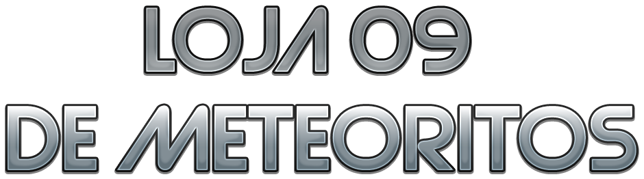
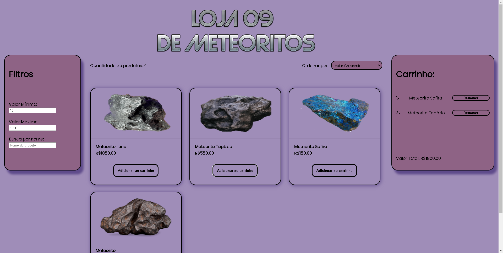

# Projeto LabECommerce

### Integrantes do Grupo 9
- João Gabriel Colodetti do Carmo
- Pétrick Machado de Almeida Grillo
- Bruno Adonai Rodrigues Monteiro

### Link para o projeto
[https://direful-taste.surge.sh/](https://ruddy-room.surge.sh/)

### Sobre
Criamos uma interface de ecommerce para uma loja de meteoritos.
Utilizamos React para a elaboração do site, junto com styled components para estilização.
Dentre as funcionalidades do projeto temos: filtros para seleção de produtos, carrinho com os items adicionados, podendo também removê-los e consultar o valor total atual da compra, além de poder atualizar a página e ter seu carrinho salvo, utilizando o local storage do navegador.

### Status do projeto
Concluido

### Imagens 

